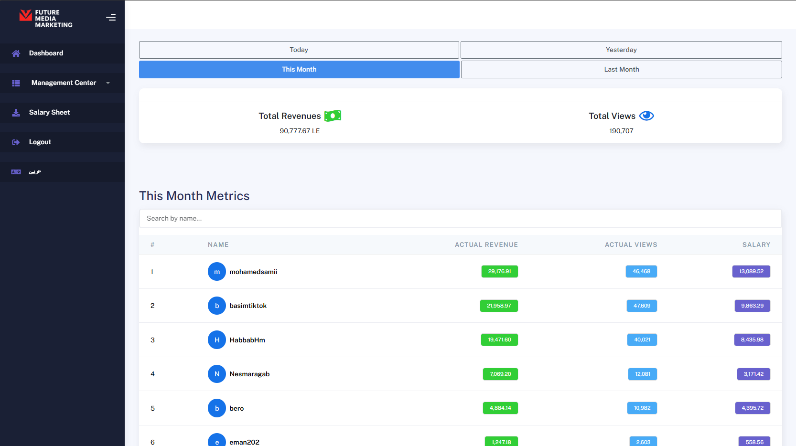

# Creator & Agencies Dashboard (Private Project — Showcase Only)

> ⚠️ **Important Notice:**  
> This project is a private, client-implemented solution. The full source code is not publicly available due to confidentiality agreements.  
> This repository serves as a **showcase only**, including screenshots and detailed documentation to demonstrate the system’s features and workflows.

---

## Table of Contents

- [Project Overview](#project-overview)  
- [User Roles & Permissions](#user-roles--permissions)  
- [Core Features](#core-features)  
- [Data Management & Filtering](#data-management--filtering)  
- [Excel Upload & Processing](#excel-upload--processing)  
- [Multi-language & Currency Support](#multi-language--currency-support)  
- [Technical Stack](#technical-stack)  
- [Project Setup (Private Repo Only)](#project-setup-private-repo-only)  
- [How This Project Helps Our Clients](#how-this-project-helps-our-clients)  
- [Screenshots & Visual Overview](#screenshots--visual-overview)  
- [Contact & Support](#contact--support)  

---

## Project Overview

This project is a comprehensive **Dashboard System** designed to streamline the management of **Content Creators** and **Agencies**. It provides administrators and end users with powerful tools for data tracking, reporting, and management — all through an intuitive, role-based interface.

Key highlights include:

- Centralized admin control with granular user and agency management.  
- Personalized dashboards for content creators reflecting their own earnings and statistics.  
- Multi-level agency management, where agencies control their own creators and view aggregated data.  
- Flexible data filtering by date ranges such as today, yesterday, current month, and previous month.  
- Seamless Excel file uploads to import scattered data, which is then parsed and reflected throughout dashboards.

---

## User Roles & Permissions

### 1. Administrator (Admin)

- Has **full access** to all data and system controls.  
- Manages all content creators and agencies — including adding, editing, and deleting.  
- Views aggregated and detailed reports for the entire system.  
- Controls currency exchange rates for revenue display in multiple currencies.  
- Uploads Excel files containing raw data, which are parsed to update dashboards automatically.  
- Downloads salary sheets for content creators based on up-to-date processed data.

### 2. Content Creators

- Each creator has a **personal dashboard** showing only their data.  
- Can update personal details such as password, profile picture, and payment method info.  
- Views earnings in both local currency (EGP) and USD, based on admin-configured exchange rates.  
- Has visibility into their revenue shares, detailed reports, and performance metrics.

#### Dashboard Section

#### Profile Section

### 3. Agencies

- Agencies are **managed by the admin** but can log in to control their own team of creators.  
- Each agency has a dashboard displaying aggregated data for all creators under it.  
- Agencies can add and manage their content creators independently.  
- Agencies see overall views, revenues, and reports specific to their organization.  
- Admin oversees and can manage any agency or view their data.

---

## Core Features

- **Role-based Dashboards:** Different views and permissions based on user roles (Admin, Creator, Agency).  
- **Advanced Data Filtering:** Filter and view data by day (today, yesterday), current month, or previous month.  
- **Dynamic Excel Integration:** Upload Excel sheets with scattered data to be parsed and displayed automatically.  
- **Salary Sheet Export:** Admin can generate and download salary sheets for content creators based on processed data.  
- **Multi-Currency Support:** Earnings shown in Egyptian Pounds and US Dollars with configurable exchange rates.  
- **User Profile Management:** Creators can update passwords, profile photos, and payment details.  
- **Full Agency Management:** Agencies control their own content creators and access related analytics.  
- **Bi-lingual Interface:** Fully supports Arabic and English languages with seamless switching.  

---

## Data Management & Filtering

The dashboard implements powerful filtering mechanisms to ensure accurate and flexible data viewing:

- Filter data by **today**, **yesterday**, **current month**, and **previous month** for quick performance checks.  
- Upload raw data via Excel files; the system automatically processes and integrates this data across dashboards.  
- Salary sheets dynamically generated based on filtered and processed data sets.  

---

## Excel Upload & Processing

- Admin uploads Excel files containing raw, scattered data representing views, earnings, or other KPIs.  
- The backend system parses the Excel file, cleans, and organizes data before updating the dashboards in real-time.  
- Salary sheets are generated from the processed data, which can then be exported and shared with content creators.  

## Multi-language & Currency Support

- Full **Arabic and English** language support with easy toggling.  
- Revenue and earnings displayed in both **Egyptian Pounds (EGP)** and **US Dollars (USD)**.  
- Admin sets the exchange rate that automatically recalculates values shown to content creators.  

---

## Technical Stack

| Layer           | Technology                         |
|-----------------|----------------------------------|
| Backend         | Laravel (PHP Framework)           |
| Database        | MySQL                            |
| Frontend        | Blade Templates, Bootstrap/Tailwind CSS |
| Excel Processing| PHPExcel / PhpSpreadsheet         |

